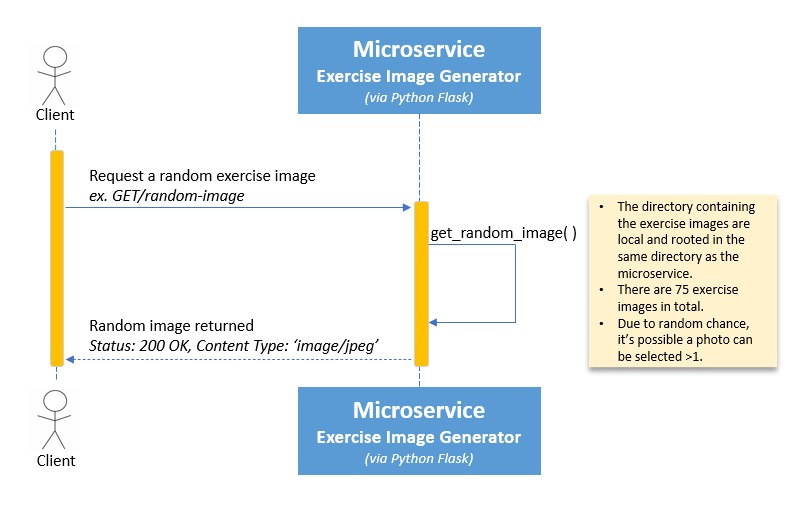

# CS361_Microservice_A_Random_Exercise_Image_Gen
This microservice provides random exercise-related images which can be leveraged for various purposes. The structure of the microservice follows a simple logic. Once it is called, it routes to the subdirectory that houses approximately 75 exercise photos. Upon accessing the subdirectory, it will at random select one photo and return that image back to the requestor. The framework being utilized for this microservice is Flask which is written in Python.

# API Communication Contract
* Endpoint: `GET/random-image`
* Calling this endpoint tells the microservice to grab and respond back with a randomly selected image, picked from the local sub directory
  
## REQUEST Format
* The client must send an HTTP GET request to the `/random-image` endpoint
  * This is not a POST or PUT request, therefore the body is blank
  * The microservice default port is 8000. Ensure no other port is used on the local network
* Example call to the microservice using fetch via JavaScript: `const image = await fetch('http://localhost:8000/random-image')`
  * This assumes the microservice is active
  * Fetch defaults to sending a `GET` request if no method option is explicitly specified

## RESPONSE Format
* Once called the microservice will choose an exercise image at random and return that image back to the client
  * It is possible to get the same image >1 over multiple calls due to random chance
* The microservice will responed with a jpeg image (Content-type: 'image/jpeg')
* Noteworthy item:
  *  If leveraging REACT as a UI, be advised getEffect() may render 2 images (the 1st image very quickly before landing on the 2nd)
      *  This is NOT a bug. The application is most likely in StrictMode by default
      *  In Strict Mode, React will try to simulate the behavior of mounting, unmounting, and remounting a component to help developers uncover bugs during testing
  * If using EXPRESS.mjs as a controller / backend, consider importing fetch and cors.

## UML Sequence Diagram

